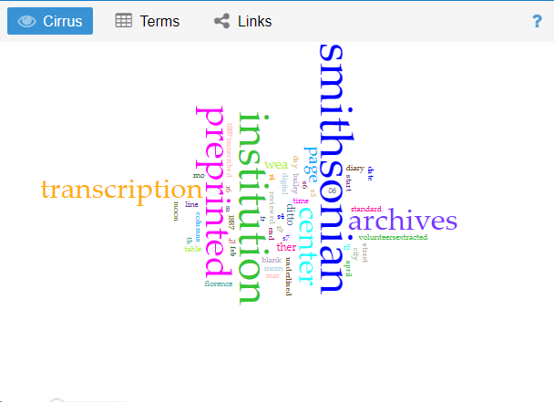
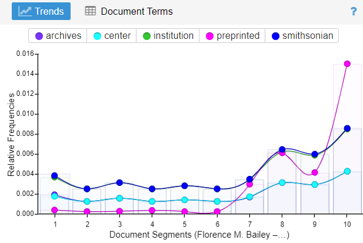
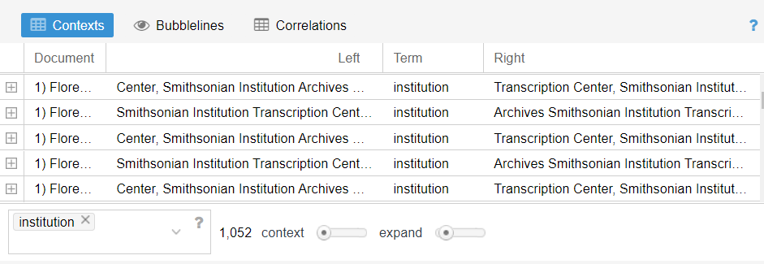
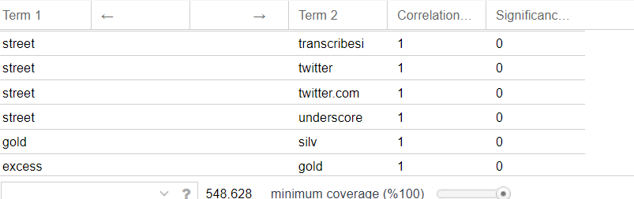

## Welcome to Alake Mills Digital Exploration of Florence M. Bailey Diary

This is a site I build with gh-pages. **Wow**

**Dataset of Digitized Diaries**

I am exploring the digitized Diary by Florence M. Bailey   
>> The pages of her diary available were from the year 1887

>> I want to pull the pages of her diary using wget. While her diary has been fully transcribed already, it was 1 only downloadable as an oddly formatted pdf and  I wanted to attempt to OCR the original scans, which was to be my second step. After I had all of the text OCR’d into one large text file, I would clean it up with regex to make it useable, then run it through my favourite exploratory tool, Voyant. After getting some “leads” through exploration with Voyant.

> I used wget to fetch the diary on my computer, the next step was the OCR and transcribing.
>Then i loaded my data on Voyant.

**Voyant Views**
So i created a corpus using voyant tool

> I checked through The diaries and the texts seemed clean enough to analyze, although my fear was that there might be some fragmented words.

> Immediately upon loading Voyant’s web tool with my data, I thought my fears about fragmentmented words in the text were correct. The voyant Cirrus showed words like "transcription", "Archives", "Institution" as most occuring words.

> I decided to take a look at the “Trends” graph visualization and noticed that many of the words were “transient” in nature words such as "archives", "institution", "center", "Smithsonian", which implies something about Institution.
.

> I then moved on to the “Contexts” tool, not just to explore these terms further and confirm that they were in fact, expressions of transcription places, Looking at the most frequently occurring term, “institution”, seemed to reveal there were doing some sort of transcription in those institutions.

> Next, I looked at the context of “smithsonian”, which seemed to be used in the library content, What does “smithsonian” mean? googling it shows me that it's the world's largest museum, education, and research complex. "Smithsonian Institution". 

> Besides looking at word frequency and contexts, the correlation tool showed several correlation and their significance.

> Exploring this diary archive led me to see clearly the impact of digital history from exploring within the corpus, although I would need further time and resource to research further how Florence M. Bailey's diary correlated with the experiences of other female artists active at the same time as she was, and this could be done once again through using digital history to exploring even more.
